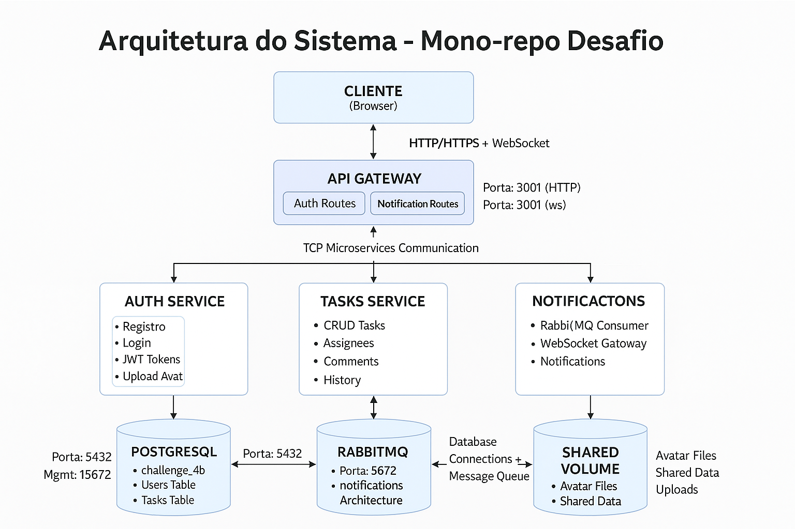

# Desafio Full-stack Júnior — Sistema de Gestão de Tarefas Colaborativo

Este é um projeto de monorepo com múltiplos serviços usando Docker e Docker Compose.

## 📊 Diagrama de Arquitetura



## 🚀 Como Executar

### Pré-requisitos

- Docker instalado e rodando
- Docker Compose instalado

### Comandos para Iniciar

1. **Parar containers existentes (se houver):**

```bash
docker compose down --remove-orphans
```

2. **Construir todas as imagens:**

```bash
docker compose build --no-cache
```

3. **Iniciar todos os serviços:**

```bash
docker compose up -d
```

4. **Verificar status dos serviços:**

```bash
docker compose ps
```

5. **Acessar a pagina cole esse link no navegador**

````bash
http://localhost:3000/```

## 📱 Serviços Disponíveis

| Serviço               | Porta | Descrição               |
| --------------------- | ----- | ----------------------- |
| Web App               | 3000  | Interface frontend      |
| API Gateway           | 3001  | Gateway da API          |
| Auth Service          | 3002  | Serviço de autenticação |
| Tasks Service         | 3003  | Serviço de tarefas      |
| Notifications Service | 3004  | Serviço de notificações |
| PostgreSQL            | 5432  | Banco de dados          |
| RabbitMQ              | 5672  | Message broker          |
| RabbitMQ Management   | 15672 | Interface do RabbitMQ   |

## 🏗️ Arquitetura

O projeto usa:

- **Frontend:** React com Vite
- **Backend:** NestJS com TypeScript
- **Banco de dados:** PostgreSQL
- **Message broker:** RabbitMQ
- **Containerização:** Docker com multi-stage builds
- **Orquestração:** Docker Compose

## 📝 Notas Importantes

- Os serviços têm dependências entre si (PostgreSQL e RabbitMQ devem estar saudáveis antes dos outros serviços)
- O Docker Compose já está configurado com health checks para garantir a ordem correta de inicialização
- As imagens são otimizadas com multi-stage builds para reduzir tamanho
- O projeto usa pnpm como gerenciador de pacotes

## 📝 Melhorias no projetos

- Autenticação via e-mail com envio de código de verificação.
- Autenticação via SMS para confirmação de identidade.
- Login social utilizando provedores como Google, GitHub e outros.
- Verificação em duas etapas (2FA) para maior segurança.
- Notificações push integradas ao navegador e/ou aplicativo móvel.
- Recuperação de senha por e-mail com link seguro de redefinição.
- Armazenamento de avatar no Amazon S3 para melhor escalabilidade.
- istribuição de imagens e avatares através do Amazon CloudFront (CDN) para otimizar o carregamento global.

## 📋 Scripts Disponíveis

### 🔧 Testes Gerais

```bash
# Executar todos os testes
pnpm test

# Executar apenas testes E2E
pnpm test:e2e

# Executar testes com cobertura
pnpm test:cov
````

### 🖥️ Testes do Backend (NestJS)

```bash
# Todos os testes do backend
pnpm test:backend
```

### 🌐 Testes do Frontend (React/Vite)

```bash
# Todos os testes do frontend
pnpm test:frontend
```

## 📊 Status Atual dos Testes

### ✅ Backend (169 testes passando)

- **api-gateway** - 73 testes (Controllers, Guards, WebSocket)
- **auth-service** - 36 testes (JWT, Hashing, Controllers)
- **tasks-service** - 32 testes (Services, Controllers, Publishers)
- **notifications-service** - 28 testes (Services, Repositories, Consumers)

### ✅ Frontend (172 testes passando)

- **Components UI** - 16 componentes testados
- **Services** - Autenticação, tarefas, usuários
- **Hooks** - useMobile, useTheme
- **Stores** - Zustand stores
- **Integration** - React Query

## ⏱️ Tempo Gasto no Desenvolvimento

| Etapa                                          | Descrição                                                                        | Duração Estimada |
| ---------------------------------------------- | -------------------------------------------------------------------------------- | ---------------- |
| 🏗️ Preparação do projeto monorepo              | Configuração inicial do ambiente, estrutura de pastas, Docker e Turborepo        | **4 horas**      |
| 🔐 Criação do back-end Auth Service            | Implementação de autenticação (login, registro, JWT, refresh token)              | **1 dia**        |
| 🧪 Testes do Auth Service                      | Testes de integração e validação de endpoints                                    | **1 dia**        |
| 📋 Criação do back-end Tasks Service           | CRUD de tarefas, comentários e atribuições                                       | **2 dias**       |
| 🧪 Testes do Tasks Service                     | Verificação de rotas, integrações e consistência de dados                        | **1 dia**        |
| 🔔 Criação do back-end Notifications/WebSocket | Implementação de eventos via RabbitMQ e entrega em tempo real                    | **2 dias**       |
| 🧪 Testes do Notifications/WebSocket           | Testes de eventos e comunicação WebSocket                                        | **1 dia**        |
| 💻 Criação do front-end                        | Desenvolvimento da interface com React, Tailwind, shadcn/ui e integração com API | **3 dias**       |
| 🧪 Testes do front-end                         | Testes de UI, fluxo de login e integração com serviços                           | **1 dia**        |

> ⏳ **Total:** aproximadamente **12 dias**.
